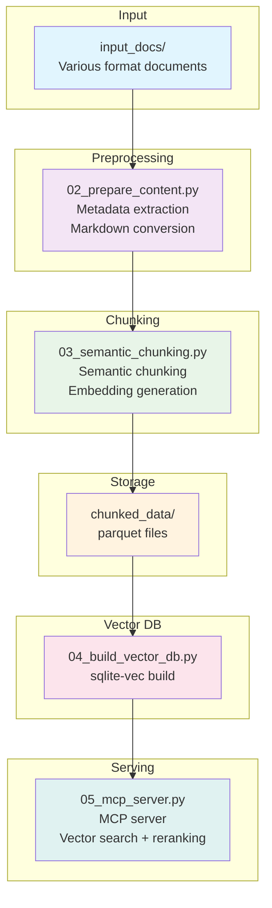

# Implementation Details

This document describes what the current reference implementation *happens to include*, not a recommended checklist for RAG systems.

Details may change as experiments evolve, but the principles and boundaries described in the [README](README.md) should not.

---

## Architecture



Intermediate results from each step are saved as parquet files, making various experiments and external system migrations easy.

---

## Why PIXIE-Rune?

This project originally used the BGE-M3 model but switched to [PIXIE-Rune](https://huggingface.co/telepix/PIXIE-Rune-Preview) for **better Korean language performance**. PIXIE-Rune is optimized for Korean text understanding while maintaining strong multilingual capabilities.

Key differences from BGE-M3:

| Feature | BGE-M3 | PIXIE-Rune |
| ------- | ------ | ---------- |
| Korean Performance | Good | **Excellent** |
| Embedding Dimension | 1024 | 1024 |
| Max Sequence Length | 8192 | 8192 |
| ONNX Support | Built-in | **Manual conversion required** |

---

## Features

> [!NOTE]
> The following features reflect implementation choices made for this experiment.
They should not be interpreted as a recommended or complete RAG feature set.

- **Support for Various Document Formats**: Using Microsoft markitdown
  - Office documents: Word (.docx), Excel (.xlsx), PowerPoint (.pptx)
  - PDF, HTML, XML, JSON, CSV
  - Images (EXIF/OCR), Audio (speech recognition), Video (subtitle extraction)
  - Code files, Jupyter Notebook, ZIP archives
- **Microsoft Foundry Service Integration** (Optional)
  - Document Intelligence: Enhanced OCR for scanned PDFs and images
  - Azure OpenAI (GPT-4o): Image content understanding
  - Only configured services are automatically activated
- **Semantic Chunking**: Chunk splitting based on semantic similarity
- **Markdown Structure Preservation**: Maintains hierarchical information like heading levels and section paths
- **Enhanced Korean Support**: PIXIE-Rune model optimized for Korean text
- **Multilingual Support**: Strong performance across multiple languages
- **ONNX Optimization**: Pre-converted ONNX model for faster CPU inference
- **Incremental Updates**: Change detection based on content hash
- **zstd Compression**: Efficient parquet storage
- **BGE Reranker**: Reranking support for improved search result accuracy
- **CPU-Friendly**: Works without GPU (automatically uses GPU if available)

---

## Supported File Formats

| Category | Extensions |
| -------- | ---------- |
| Office Documents | `.docx`, `.doc`, `.xlsx`, `.xls`, `.pptx`, `.ppt` |
| PDF/Web | `.pdf`, `.html`, `.htm`, `.xml`, `.json`, `.csv` |
| Markdown/Text | `.md`, `.markdown`, `.txt`, `.rst` |
| Images (EXIF/OCR) | `.jpg`, `.jpeg`, `.png`, `.gif`, `.bmp`, `.webp`, `.tiff` |
| Audio (Speech Recognition) | `.mp3`, `.wav`, `.m4a`, `.ogg`, `.flac` |
| Video (Subtitle Extraction) | `.mp4`, `.mkv`, `.avi`, `.mov`, `.webm` |
| Code/Other | `.py`, `.js`, `.ts`, `.java`, `.c`, `.cpp`, `.ipynb`, `.zip` |

---

## Module Structure

| Module | Description |
| ------ | ----------- |
| `01_download_model.py` | PIXIE-Rune embedding model download + ONNX conversion |
| `02_prepare_content.py` | Metadata extraction and YAML front matter generation |
| `03_semantic_chunking.py` | Semantic chunking and parquet storage |
| `04_build_vector_db.py` | sqlite-vec vector DB build and search |
| `05_mcp_server.py` | MCP server (stdio/SSE mode support) |
| `embedding_model.py` | Unified embedding interface (ONNX/PyTorch) |

---

## Installation

### Installing uv

uv is a fast Python package manager. Install it from the official repository:

**Windows (PowerShell):**

```powershell
powershell -c "irm https://astral.sh/uv/install.ps1 | iex"
```

**Linux/macOS:**

```bash
curl -LsSf https://astral.sh/uv/install.sh | sh
```

Or install via pip:

```bash
pip install uv
```

For more installation options, visit: <https://github.com/astral-sh/uv>.

### Installing Dependencies

```bash
# Using uv (recommended)
uv sync

# Or using pip
pip install FlagEmbedding mistune pyarrow pandas pyyaml markitdown[all]
```

> **Note**: The `huggingface-hub[hf_xet]` package is included to improve download speeds for Xet Storage-supported models.

---

## Containerization

The program can be containerized using Docker. Model files are mounted as host volumes for caching.

### Build and Run

```bash
# Build image
docker-compose build

# Run (automatic model download → data processing → server start)
docker-compose up

# Or stdio mode
docker-compose run --rm aipack ./entrypoint.sh

# Specify port
PORT=9090 docker-compose up
```

### Execution Flow

The container automatically performs the following steps on startup:

1. **Model Download**: Check cache and download PIXIE-Rune embedding model + ONNX conversion
2. **Data Processing**: If `input_docs/` exists, prepare documents → chunking → vector DB build
3. **Server Start**: Run MCP server (SSE mode by default)

> **Note**: Works even in environments without uv or Python runtime (multi-stage build)

### Volume Mounts

- **Model Cache**: `./cache/huggingface` → `/root/.cache/huggingface` in container
  - Stores large files like BGE-M3 and reranker models in project's `cache/` directory
  - Explicit `cache_dir` setting in code controls cache location
  - Cache reuse on container restart saves download time
- **Data Directories**: `input_docs`, `prepared_contents`, `chunked_data`, `vector_db`
  - Data sharing between host and container

### Environment Variables

- `PYTHONUNBUFFERED=1`: Immediate log output

---

## Microsoft Foundry Service Integration (Optional)

Works with basic markitdown alone, but better results can be achieved by integrating Microsoft Foundry services.

### Supported Services

| Service | Purpose | Enhanced Features |
| ------- | ------- | ----------------- |
| Document Intelligence | Scanned PDF, image OCR | Text extraction accuracy |
| Azure OpenAI (GPT-4o) | Image content understanding | Image description generation |

### Configuration

```bash
# 1. Create environment file
cp .env.example .env

# 2. Enter only necessary keys (only configured services are activated)
```

Example `.env` file:

```env
# Document Intelligence (scanned PDF, image OCR)
AZURE_DOCUMENT_INTELLIGENCE_ENDPOINT=https://your-resource.cognitiveservices.azure.com/
AZURE_DOCUMENT_INTELLIGENCE_KEY=your-key

# Azure OpenAI (image content understanding)
AZURE_OPENAI_ENDPOINT=https://your-openai.openai.azure.com/
AZURE_OPENAI_API_KEY=your-key
AZURE_OPENAI_DEPLOYMENT_NAME=gpt-4o
```

### Operation

- **No Keys**: Uses basic markitdown only
- **Some Services Configured**: Only those services are activated
- **All Configured**: Full functionality activated

Integration status is displayed during execution:

```text
🔗 Azure services integrated: Document Intelligence, OpenAI (gpt-4o)
```

Or:

```text
ℹ️ Azure services not integrated (using basic markitdown)
```

---

## Usage

### 1. Model Download and ONNX Conversion (One-time)

```bash
python 01_download_model.py
```

This script:

1. Downloads the PIXIE-Rune embedding model from Hugging Face
2. Downloads the BGE Reranker model
3. **Converts the embedding model to ONNX format** for faster CPU inference

The ONNX conversion is automatic and saves the optimized model to `cache/onnx_model/`.

### 2. Document Preparation

Place files in `input_docs/` directory (various formats supported):

```bash
python 02_prepare_content.py
```

All supported file formats are converted to Markdown with metadata added.

#### PDF Processing Options

PDF files can be processed using two different libraries. Set the `PDF_PROCESSOR` environment variable to choose:

| Value | Library | Description |
| ----- | ------- | ----------- |
| `pymupdf4llm` (default) | PyMuPDF4LLM | LLM-optimized extraction, better table/structure preservation, automatic line break normalization |
| `markitdown` | Microsoft MarkItDown | Azure AI integration support (Document Intelligence OCR) |

```bash
# Use default (pymupdf4llm)
python 02_prepare_content.py

# Use markitdown (for Azure AI integration)
PDF_PROCESSOR=markitdown python 02_prepare_content.py
```

Or add to `.env` file:

```env
PDF_PROCESSOR=pymupdf4llm  # or "markitdown"
```

**When to use each option:**

- **pymupdf4llm** (recommended): Best for most PDFs, especially those with complex layouts, tables, or Korean text. Automatically removes unnecessary line breaks caused by PDF page layouts.
- **markitdown**: Use when Azure Document Intelligence OCR is needed for scanned PDFs or images.

### 3. Semantic Chunking

```bash
python 03_semantic_chunking.py
```

Options:

- `--input-dir`: Input directory (default: `prepared_contents`)
- `--output-dir`: Output directory (default: `chunked_data`)
- `--similarity-threshold`: Similarity threshold (default: 0.5)

### 4. Vector DB Build

```bash
python 04_build_vector_db.py
```

Options:

- `--input-dir`: Input directory (default: `chunked_data`)
- `--output-dir`: Output directory (default: `vector_db`)
- `--db-name`: DB filename (default: `vectors.db`)
- `--export-parquet`: Export parquet for Milvus/Qdrant migration
- `--test-search "query"`: Perform test search after build

#### Vector DB Portability

Exported parquet files (`vectors_export.parquet`) can be directly imported to the following vector DBs:

| Vector DB | Import Method |
| --------- | ------------- |
| **Milvus** | Direct import using `pymilvus`'s `insert()` method |
| **Qdrant** | Upsert via REST API or Python client |
| **Pinecone** | Direct import using `upsert()` method |
| **Chroma** | Direct import using `add()` method |

Vector format: `float32[1024]` (PIXIE-Rune Dense vectors)

### 5. MCP Server Execution

Provides vector search via MCP protocol.

#### stdio Mode (Claude Desktop, Cursor, etc.)

```bash
python 05_mcp_server.py
```

#### SSE Mode (Web clients)

```bash
python 05_mcp_server.py --sse --port 8080
```

Options:

- `--db-path`: Vector DB path (default: `vector_db/vectors.db`)
- `--sse`: Run in SSE mode
- `--host`: SSE server host (default: `127.0.0.1`)
- `--port`: SSE server port (default: `8080`)

#### Available Tools

| Tool | Description |
| ---- | ----------- |
| `search` | Vector similarity search + reranking |
| `get_chunk` | Detailed lookup by chunk ID |
| `list_documents` | Document list lookup |
| `get_stats` | DB statistics lookup |

#### Claude Desktop Configuration Example

`claude_desktop_config.json`:

```json
{
  "mcpServers": {
    "aipack-vector-search": {
      "command": "python",
      "args": ["D:/Projects/aipack/05_mcp_server.py"]
    }
  }
}
```

---

## Testing MCP Server in IDEs

This repository includes pre-configured MCP settings for VS Code and Cursor. Simply open the project folder to automatically connect to the MCP server.

### Supported IDEs

| IDE | Configuration File | Requirements |
| --- | ------------------ | ------------ |
| **VS Code + GitHub Copilot** | `.vscode/mcp.json` | GitHub Copilot Chat extension |
| **Cursor** | `.cursor/mcp.json` | Built-in MCP support |

### Quick Start

1. **Install dependencies and download models**:

   ```bash
   uv sync
   uv run python 01_download_model.py
   ```

2. **Prepare sample data** (or add your own documents to `input_docs/`):

   ```bash
   uv run python 02_prepare_content.py
   uv run python 03_semantic_chunking.py
   uv run python 04_build_vector_db.py
   ```

3. **Open the project folder** in VS Code or Cursor

4. **Start using MCP tools** in the chat:
   - The MCP server starts automatically when you open the folder
   - Available tools: `search`, `get_chunk`, `list_documents`, `get_stats`

### Configuration Files

**VS Code** (`.vscode/mcp.json`):

```json
{
  "servers": {
    "aipack-vector-search": {
      "type": "stdio",
      "command": "uv",
      "args": ["run", "python", "05_mcp_server.py"],
      "cwd": "${workspaceFolder}"
    }
  }
}
```

**Cursor** (`.cursor/mcp.json`):

```json
{
  "mcpServers": {
    "aipack-vector-search": {
      "command": "uv",
      "args": ["run", "python", "05_mcp_server.py"],
      "cwd": "${workspaceFolder}"
    }
  }
}
```

### Troubleshooting

| Issue | Solution |
| ----- | -------- |
| MCP server not starting | Ensure `uv sync` was run and models are downloaded |
| Search returns errors | Restart the MCP server (VS Code: `Ctrl+Shift+P` → `MCP: Restart Server`) |
| No vector DB found | Run steps 2-4 to build the vector database |
| Model loading slow | First run downloads ~5GB of models; subsequent runs use cache |

---

## Output Schema

| Field | Type | Description |
| ----- | ---- | ----------- |
| `chunk_id` | string | Unique chunk ID |
| `content_hash` | string | Content hash (for incremental updates) |
| `chunk_text` | string | Chunk text |
| `chunk_type` | string | Type (header, paragraph, list, code, table) |
| `heading_level` | int32 | Heading level (0=normal, 1-6=H1-H6) |
| `heading_text` | string | Current heading text |
| `parent_heading` | string | Parent heading text |
| `section_path` | list[string] | Section hierarchy path array |
| `table_headers` | list[string] | Table column headers (if table) |
| `table_row_count` | int32 | Table data row count (if table) |
| `domain` | string | Domain (metadata) |
| `keywords` | string | Keywords JSON (metadata) |
| `version` | int32 | Version number |

---

## Directory Structure

```text
reconsidered_rag/
├── 01_download_model.py       # PIXIE-Rune model download + ONNX conversion
├── 02_prepare_content.py      # Metadata extraction + Azure integration
├── 03_semantic_chunking.py    # Semantic chunking
├── 04_build_vector_db.py      # Vector DB build
├── 05_mcp_server.py     # MCP server (stdio/SSE)
├── embedding_model.py         # Unified embedding interface
├── input_docs/                # Input documents
├── prepared_contents/         # Documents with metadata added
├── chunked_data/              # Chunked parquet files
├── cache/
│   ├── huggingface/           # Model cache directory
│   └── onnx_model/            # ONNX converted model
├── vector_db/                 # sqlite-vec vector DB
│   ├── vectors.db             # Local vector DB
│   └── vectors_export.parquet # Export file for migration
├── .env.example               # Environment variable template
├── pyproject.toml
└── README.md
```

---

## System Requirements

- Python 3.11+
- ~5GB disk space (for PIXIE-Rune + reranker models + ONNX cache)
- 8GB+ RAM recommended
- GPU (optional): Automatically utilized if CUDA-compatible GPU available

---

## Future Extension Possibilities

> [!NOTE]
> These extensions are intentionally not implemented yet.
They are listed to document design intent, not roadmap commitments.

The current system is designed with the following extensions in mind:

| Extension Direction | Description | Current Status |
| ------------------- | ----------- | -------------- |
| **Graph RAG** | Ontology-based entity/relation extraction → Node/edge parquet generation | Design completed |
| **Hybrid Search** | Combination of keyword + vector + graph search | Vector + reranking implemented |
| **Homonym Handling** | Context distinction via domain-specific ontology mapping | Metadata-based |
| **Multiple Vector DBs** | Migration to Milvus, Qdrant, Pinecone, etc. | Parquet export supported |
