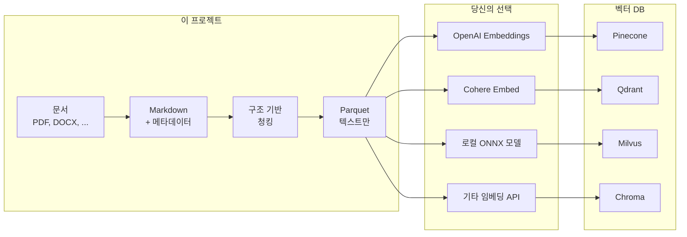

# Reconsidered RAG

[](https://opensource.org/licenses/Apache-2.0)
[](https://www.python.org/)
[](https://github.com/sponsors/rkttu)

**[English](README.md)** | 한국어

[](https://youtu.be/Uj6Vz5CZ4c4)

**RAG를 위한 문서 준비: 오프라인, 이식 가능, 인프라 독립적.**

---

## 핵심 요약

> **이것은 빠른 RAG DB 빌더가 아닙니다.**
> **이것은 데이터를 소유하고 싶은 사람들을 위한 도구입니다.**
>
> 빠른 RAG 구축을 원한다면 LangChain이나 LlamaIndex를 사용하세요.
> **데이터 주권**과 **벤더 종속 방지**를 원한다면 계속 읽어보세요.

---

## 누구를 위한 프로젝트인가?

| 원하는 것 | 이 프로젝트는... |
| --------- | --------------- |
| 5분 안에 RAG 구축 | ❌ 맞지 않음 |
| 특정 임베딩 모델 고정 | ❌ 맞지 않음 |
| 블랙박스 파이프라인 | ❌ 맞지 않음 |
| **이식 가능한 포맷으로 데이터 소유** | ✅ 적합 |
| **사람이 읽을 수 있는 체크포인트** | ✅ 적합 |
| **언제든 다른 모델로 재임베딩** | ✅ 적합 |
| **어떤 벡터 DB로든 마이그레이션** | ✅ 적합 |

---

## 세 가지 사용 사례

### 💰 인프라 투자가 어려운 곳

**GPU 없음. 클라우드 없음. 비싼 구독 없음.**

- 코어 파이프라인은 모든 노트북에서 오프라인 실행
- ~200MB 설치 (임베딩 포함 도구의 2GB+ 대비)
- 준비되었을 때만 임베딩/벡터 DB 비용 지불

### 🔐 데이터 주권이 중요한 곳

**데이터가 절대 내 머신을 떠나지 않습니다.**

- 모든 처리가 로컬에서 수행
- 영원히 통제할 수 있는 이식 가능한 포맷 (Markdown, Parquet)
- 벤더 종속 없음 — 언제든 임베딩 모델이나 벡터 DB 변경 가능
- 버전 관리와 감사를 위한 Git 친화적 체크포인트

### ⚡ 빠른 시작, 완전한 통제

**2개 명령으로 시작. 어떤 클라우드나 로컬 모델과도 통합 가능.**

```bash
uv sync
uv run python main.py run
```

그 다음 원하는 스택 선택:

| 컴포넌트 | 선택지 |
| -------- | ------ |
| **임베딩** | OpenAI, Azure OpenAI, Cohere, Voyage, Google, AWS Bedrock, 로컬 ONNX |
| **벡터 DB** | Pinecone, Qdrant, Milvus, Chroma, Weaviate, Azure AI Search, pgvector |
| **LLM** | GPT-4, Claude, Gemini, Llama, Mistral, 또는 MCP 호환 클라이언트 |

**CSP 종속 없음.** Parquet 출력은 모든 서비스와 호환됩니다.

```python
# 예시: Azure OpenAI
from openai import AzureOpenAI
client = AzureOpenAI(azure_endpoint="...", api_key="...")
embeddings = client.embeddings.create(model="text-embedding-3-large", input=texts)

# 예시: AWS Bedrock
import boto3
client = boto3.client("bedrock-runtime")
response = client.invoke_model(modelId="amazon.titan-embed-text-v2:0", body=...)

# 예시: 로컬 ONNX
from sentence_transformers import SentenceTransformer
model = SentenceTransformer("BAAI/bge-m3")
embeddings = model.encode(texts)
```

---

## 이 프로젝트가 하는 일



**이 프로젝트가 하는 일:**

- ✅ 문서를 Markdown으로 변환
- ✅ 구조 기반 청킹 (헤딩, 문단)
- ✅ Parquet으로 내보내기 (텍스트만)

**당신이 할 일:**

- 임베딩 모델 선택
- 벡터 DB 선택
- 프로덕션 서빙

---

## 왜 이 방식인가?

| 문제 | 우리의 해결책 |
| ---- | ------------ |
| 임베딩 모델이 빠르게 바뀜 | 텍스트가 Parquet에 있으니 언제든 재임베딩 |
| 벡터 DB를 결정 못함 | 한 번 준비하고 어디든 가져오기 |
| 데이터가 로컬을 떠날 수 없음 | 모든 것이 오프라인 실행 |
| 콘텐츠 감사/검토 필요 | 사람이 읽을 수 있는 Markdown 체크포인트 |

---

## 파이프라인

| 단계 | 스크립트 | 입력 | 출력 |
| ---- | -------- | ---- | ---- |
| 1a | `01_prepare_markdowndocs.py` | Markdown, TXT, RST | Markdown (prepared_contents/) |
| 1b | `01_prepare_officedocs.py` | DOCX, XLSX, PPTX, PDF 등 | Markdown (prepared_contents/) |
| 2 | `02_enrich_content.py` | Markdown | 보강된 Markdown (enriched_contents/) |
| 3 | `03_chunk_content.py` | Markdown | 청크 Parquet (chunked_data/) |

**여러 `01_prepare_*` 스크립트가 공존 가능**합니다:
- `01_prepare_markdowndocs.py` — 이미 텍스트 기반 (패스스루 + 메타데이터)
- `01_prepare_officedocs.py` — 변환이 필요한 바이너리 형식
- `01_prepare_discourse.py` — (향후) PostgreSQL 포럼 덤프
- `01_prepare_github.py` — (향후) GitHub 이슈/PR

모두 Markdown 출력 → 동일한 `02_enrich` → `03_chunk` 파이프라인.

---

## 응용 예시

Parquet 출력물은 어떤 임베딩 모델과 벡터 DB와도 사용 가능합니다.
이 저장소에는 참조 구현이 포함되어 있습니다:

| 예시 | 설명 |
| ---- | ---- |
| `example_sqlitevec_mcp.py` | sqlite-vec + MCP 서버로 로컬 테스트 |

---

## 두 개의 사람이 읽을 수 있는 체크포인트

### 1. `prepared_contents/` — 편집 가능한 Markdown

- **자동 보강**: OCR, 이미지 설명, 음성-텍스트 (선택적, Azure AI 사용)
- **사람이 편집 가능**: 오류 수정, 맥락 추가, 노이즈 제거
- **버전 관리 가능**: 일반 텍스트는 Git과 호환

### 2. `chunked_data/` — 이식 가능한 Parquet

- **청크 텍스트 보존**: 어떤 모델로든 임베딩할 원본 텍스트
- **구조 정보**: `section_path`, `heading_level`, `element_type`
- **테이블 메타데이터**: `table_headers`, `table_row_count`

---

## 빠른 시작

### Fast Path (2개 명령)

```bash
uv sync
uv run python main.py run
```

끝입니다. 문서가 `chunked_data/*.parquet`에 준비되었습니다.

### LLM 보강 포함

```bash
uv run python main.py run --enrich
```

### 단계별 실행 (고급 사용자)

```bash
# 1. 문서 준비 (input_docs/에 파일 넣기)
uv run python main.py prepare

# 2. LLM 보강 (선택적, Azure OpenAI 필요)
uv run python main.py enrich

# 3. 구조 기반 청킹
uv run python main.py chunk

# 완료! chunked_data/*.parquet 확인
```

### Parquet 파일 사용하기

```python
import pandas as pd

# 청크 로드
df = pd.read_parquet("chunked_data/your_document.parquet")

# 임베딩할 텍스트 추출
texts = df["chunk_text"].tolist()

# 원하는 임베딩 모델 사용
from openai import OpenAI
client = OpenAI()
embeddings = client.embeddings.create(
    model="text-embedding-3-large",
    input=texts
).data

# 원하는 벡터 DB에 삽입
# ... 여기에 코드 작성
```

---

## 지원 파일 포맷

| 카테고리 | 확장자 |
| -------- | ------ |
| 오피스 | `.docx`, `.xlsx`, `.pptx` 등 |
| PDF/웹 | `.pdf`, `.html`, `.xml`, `.json`, `.csv` |
| Markdown/텍스트 | `.md`, `.txt`, `.rst` |
| 이미지 (EXIF/OCR) | `.jpg`, `.png`, `.webp` 등 |
| 오디오 (음성-텍스트) | `.mp3`, `.wav`, `.m4a` 등 |
| 비디오 (자막 추출) | `.mp4`, `.mkv`, `.avi` 등 |
| 코드 | `.py`, `.js`, `.ts`, `.java` 등 |

---

## 청킹 전략

**구조 기반 청킹**은 문서 구조를 존중합니다:

1. **헤딩 경계**: 각 헤딩이 새 청크를 시작
2. **테이블/코드/리스트**: 가능하면 그대로 유지
3. **큰 문단**: 문장 경계에서 오버랩과 함께 분할
4. **크기 설정 가능**: `--max-chunk-size`, `--min-chunk-size`

```bash
# 커스텀 청크 크기
uv run python 02_chunk_content.py --max-chunk-size 1500 --min-chunk-size 50
```

---

## 선택 사항: 벡터 DB & MCP 서버

sqlite-vec로 로컬 테스트를 원한다면:

```bash
# 선택적 의존성 설치
uv sync --extra vectordb
uv sync --extra mcp

# 벡터 DB 빌드 (BGE-M3 기본)
uv run python example_sqlitevec_mcp.py build

# 다른 임베딩 모델 사용
uv run python example_sqlitevec_mcp.py build --model intfloat/multilingual-e5-large

# 지원 모델 목록
uv run python example_sqlitevec_mcp.py --list-models

# MCP 서버 실행 (stdio 모드)
uv run python example_sqlitevec_mcp.py serve

# SSE 모드
uv run python example_sqlitevec_mcp.py serve --sse --port 8080

# 빌드 + 서버 한 번에
uv run python example_sqlitevec_mcp.py all
```

---

## 상세 문서

설치, 설정, Docker, IDE 연동 등에 대해서는 **[IMPLEMENTATION.md](IMPLEMENTATION.md)**를 참고하세요.

---

## 라이선스

[Apache License 2.0](LICENSE)

## 후원

이 프로젝트가 도움이 되셨다면, GitHub Sponsors에서 후원을 고려해 주세요.

[](https://github.com/sponsors/rkttu)

## 기여하기

1. 이 저장소를 포크하세요
2. 브랜치를 생성하세요: `git checkout -b feature/amazing-feature`
3. 커밋하세요: `git commit -m 'Add amazing feature'`
4. 푸시하세요: `git push origin feature/amazing-feature`
5. Pull Request를 생성하세요
