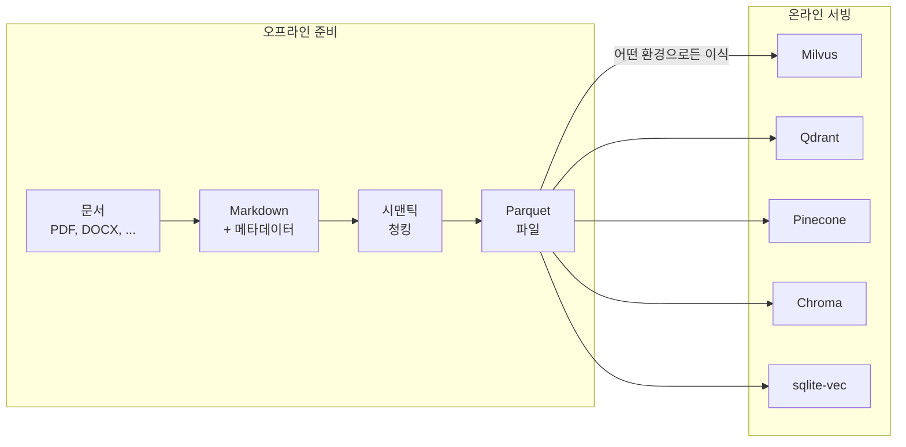

# Reconsidered RAG

[](https://opensource.org/licenses/Apache-2.0)
[](https://www.python.org/)
[](https://modelcontextprotocol.io/)
[](https://github.com/sponsors/rkttu)

**[English](README.md)** | 한국어

[](https://youtu.be/Uj6Vz5CZ4c4)

**RAG 데이터셋은 어떻게 준비되어야 하는가를 다시 생각합니다: 오프라인, 이식 가능, 인프라 독립적.**

---

## 이 프로젝트가 하는 일



**핵심 가치:**

- 🖥️ **GPU 불필요** — ONNX 최적화로 CPU만으로 임베딩
- 📦 **Parquet 기반** — 범용 포맷, 어디서든 이식 가능
- 🔒 **오프라인 준비** — 데이터가 외부로 나가지 않음
- 🔄 **재임베딩 용이** — 더 나은 모델로 언제든 교체 가능

---

## 왜 이 방식인가?

| 상황 | 이 프로젝트의 접근 방식 |
| ------ | ------------------------ |
| 벡터 DB를 아직 결정하지 못했을 때 | parquet으로 준비하고, 나중에 결정 |
| GPU 서버가 없을 때 | CPU에서 ONNX로 처리 |
| 데이터를 클라우드에 보낼 수 없을 때 | 모든 것이 로컬에서 실행 |
| 나중에 더 좋은 임베딩 모델이 나올 때 | 텍스트가 parquet에 있으니, 재계산만 하면 됨 |
| 빠르게 프로토타입을 만들고 싶을 때 | sqlite-vec로 즉시 테스트 |

---

## 파이프라인

| 단계 | 스크립트 | 입력 | 출력 |
| ------ | -------- | ------- | -------- |
| 1 | `01_download_model.py` | - | ONNX 모델 (cache/) |
| 2 | `02_prepare_content.py` | 문서 (input_docs/) | Markdown (prepared_contents/) |
| 3 | `03_semantic_chunking.py` | Markdown | 청크 parquet (chunked_data/) |
| 4 | `04_build_vector_db.py` | 청크 parquet | 벡터 DB (vector_db/) |
| 5 | `05_build_mcp_server.py` | 벡터 DB | MCP 서버 (테스트용) |

**모든 중간 결과는 parquet으로 저장됩니다.** 어떤 단계에서든 내보내서 다른 시스템으로 마이그레이션할 수 있습니다.

---

## 두 개의 사람이 읽을 수 있는 체크포인트

### 1. `prepared_contents/` — 편집 가능한 Markdown

- **자동 보강**: Azure AI를 통한 OCR, 이미지 설명, 음성-텍스트 변환
- **사람이 편집 가능**: OCR 오류 수정, 맥락 추가, 노이즈 제거
- **버전 관리 가능**: 일반 텍스트 형식이라 Git과 호환

### 2. `chunked_data/` — 이식 가능한 Parquet

- **청크 텍스트 보존**: 언제든 재임베딩을 위한 원본 텍스트
- **구조 정보**: `section_path`, `heading_level`, `element_type`
- **테이블 메타데이터**: `table_headers`, `table_row_count`

---

## 벡터 DB 이식성

`04_build_vector_db.py --export-parquet`으로 내보낸 파일은 다음으로 직접 가져올 수 있습니다:

| 벡터 DB | 가져오기 방법 |
| ----------- | --------------- |
| **Milvus** | `pymilvus` `insert()` |
| **Qdrant** | REST API 또는 Python 클라이언트 `upsert()` |
| **Pinecone** | `upsert()` |
| **Chroma** | `add()` |

벡터 포맷: `float32[1024]` (PIXIE-Rune Dense 벡터)

**임베딩을 다시 계산하고 싶으신가요?**  
원본 텍스트(`chunk_text`)가 parquet에 있습니다 — OpenAI `text-embedding-3-large`, Cohere, 또는 원하는 어떤 모델이든 사용하세요.

---

## 빠른 시작

```bash
# 의존성 설치
uv sync

# 1. 모델 다운로드 + ONNX 변환 (최초 1회)
uv run python 01_download_model.py

# 2. 문서 준비 (input_docs/에 파일을 넣으세요)
uv run python 02_prepare_content.py

# 3. 시맨틱 청킹
uv run python 03_semantic_chunking.py

# 4. 벡터 DB 구축 (+ parquet 내보내기)
uv run python 04_build_vector_db.py --export-parquet

# 5. (선택) MCP 서버로 테스트
uv run python 05_build_mcp_server.py
```

---

## 지원 파일 포맷

| 카테고리 | 확장자 |
| ---------- | ------------ |
| 오피스 | `.docx`, `.xlsx`, `.pptx` 등 |
| PDF/웹 | `.pdf`, `.html`, `.xml`, `.json`, `.csv` |
| Markdown/텍스트 | `.md`, `.txt`, `.rst` |
| 이미지 (EXIF/OCR) | `.jpg`, `.png`, `.webp` 등 |
| 오디오 (음성-텍스트) | `.mp3`, `.wav`, `.m4a` 등 |
| 비디오 (자막 추출) | `.mp4`, `.mkv`, `.avi` 등 |
| 코드 | `.py`, `.js`, `.ts`, `.java` 등 |

---

## 속도에 대하여

**이 프로젝트는 빠르지 않습니다.** 그리고 괜찮습니다.

- 이것은 **오프라인 준비 도구**입니다
- 한 번만 빌드하면 됩니다
- 프로덕션 서빙은 더 빠른 환경에서 이루어집니다 (GPU, 클라우드 벡터 DB)

속도가 최우선이라면, OpenAI Embeddings API + Pinecone을 사용하세요.  
**데이터를 외부로 보내지 않고 준비하는 것이 목표라면**, 이 프로젝트가 적합합니다.

---

## 상세 문서

설치, 설정, Docker, IDE 연동 등에 대해서는 **[IMPLEMENTATION.md](IMPLEMENTATION.md)**를 참고하세요.

---

## 라이선스

[Apache License 2.0](LICENSE)

## 후원

이 프로젝트가 도움이 되셨다면, GitHub Sponsors에서 후원을 고려해 주세요.

[](https://github.com/sponsors/rkttu)

## 기여하기

1. 이 저장소를 포크하세요
2. 브랜치를 생성하세요: `git checkout -b feature/amazing-feature`
3. 커밋하세요: `git commit -m 'Add amazing feature'`
4. 푸시하세요: `git push origin feature/amazing-feature`
5. Pull Request를 생성하세요
