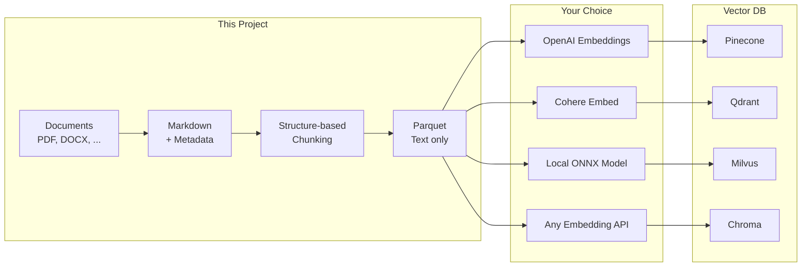

# Reconsidered RAG

[](https://opensource.org/licenses/Apache-2.0)
[](https://www.python.org/)
[](https://github.com/sponsors/rkttu)

English | **[한국어](README.ko.md)**

[](https://youtu.be/Uj6Vz5CZ4c4)

**RAG-ready document preparation: offline, portable, infrastructure-agnostic.**

---

## TL;DR

> **This is NOT a fast RAG DB builder.**
> **This is a tool for people who want to own their data.**
>
> If you want a quick RAG setup, use LangChain or LlamaIndex.
> If you want **data sovereignty** and **no vendor lock-in**, read on.

---

## Who is this for?

| If you want... | This project is... |
| -------------- | ------------------ |
| Quick RAG in 5 minutes | ❌ Not for you |
| Lock-in to a specific embedding model | ❌ Not for you |
| Black-box pipeline | ❌ Not for you |
| **Own your data in portable formats** | ✅ For you |
| **Human-readable checkpoints** | ✅ For you |
| **Re-embed anytime with any model** | ✅ For you |
| **Migrate to any vector DB** | ✅ For you |

---

## Three Use Cases

### 💰 Low Infrastructure Budget

**No GPU. No cloud. No expensive subscriptions.**

- Core pipeline runs on any laptop, offline
- ~200MB install (vs 2GB+ for embedding-bundled tools)
- Pay for embedding/vector DB only when you're ready

### 🔐 Data Sovereignty Required

**Your data never leaves your machine.**

- All processing happens locally
- Portable formats (Markdown, Parquet) you control forever
- No vendor lock-in — switch embedding models or vector DBs anytime
- Git-friendly checkpoints for version control and audit

### ⚡ Fast Start, Full Control

**2 commands to get started. Integrate with any cloud or local model.**

```bash
uv sync
uv run python main.py run
```

Then choose YOUR stack:

| Component | Your Options |
| --------- | ------------ |
| **Embedding** | OpenAI, Azure OpenAI, Cohere, Voyage, Google, AWS Bedrock, local ONNX |
| **Vector DB** | Pinecone, Qdrant, Milvus, Chroma, Weaviate, Azure AI Search, pgvector |
| **LLM** | GPT-4, Claude, Gemini, Llama, Mistral, or any MCP-compatible client |

**No CSP lock-in.** The Parquet output works with all of them.

```python
# Example: Azure OpenAI
from openai import AzureOpenAI
client = AzureOpenAI(azure_endpoint="...", api_key="...")
embeddings = client.embeddings.create(model="text-embedding-3-large", input=texts)

# Example: AWS Bedrock
import boto3
client = boto3.client("bedrock-runtime")
response = client.invoke_model(modelId="amazon.titan-embed-text-v2:0", body=...)

# Example: Local ONNX
from sentence_transformers import SentenceTransformer
model = SentenceTransformer("BAAI/bge-m3")
embeddings = model.encode(texts)
```

---

## What this project does



**This project:**

- ✅ Converts documents to Markdown
- ✅ Chunks by structure (headings, paragraphs)
- ✅ Exports as Parquet (text only)

**Your responsibility:**

- Embedding model selection
- Vector DB choice
- Production serving

---

## Why this approach?

| Problem | Our Solution |
| ------- | ------------ |
| Embedding models change fast | Text in Parquet, re-embed anytime |
| Can't decide on vector DB | Prepare once, import anywhere |
| Data can't leave local machine | Everything runs offline |
| Need to audit/review content | Human-readable Markdown checkpoint |

---

## Pipeline

| Step | Script | Input | Output |
| ---- | ------ | ----- | ------ |
| 1a | `01_prepare_markdowndocs.py` | Markdown, TXT, RST | Markdown (prepared_contents/) |
| 1b | `01_prepare_officedocs.py` | DOCX, XLSX, PPTX, PDF, etc. | Markdown (prepared_contents/) |
| 2 | `02_enrich_content.py` | Markdown | Enriched Markdown (enriched_contents/) |
| 3 | `03_chunk_content.py` | Markdown | Chunk Parquet (chunked_data/) |

**Multiple `01_prepare_*` scripts can coexist** for different data sources:
- `01_prepare_markdowndocs.py` — Already text-based (pass-through + metadata)
- `01_prepare_officedocs.py` — Binary formats requiring conversion
- `01_prepare_discourse.py` — (future) PostgreSQL forum dump
- `01_prepare_github.py` — (future) GitHub Issues/PRs

All produce Markdown → same `02_enrich` → `03_chunk` pipeline.

---

## Application Examples

The Parquet output can be used with any embedding model and vector DB.
This repository includes one reference implementation:

| Example | Description |
| ------- | ----------- |
| `example_sqlitevec_mcp.py` | sqlite-vec + MCP server for local testing |

---

## Two Human-Readable Checkpoints

### 1. `prepared_contents/` — Editable Markdown

- **Auto-enriched**: OCR, image descriptions, speech-to-text (optional, via Azure AI)
- **Human-editable**: Fix errors, add context, remove noise
- **Version-controllable**: Plain text works with Git

### 2. `chunked_data/` — Portable Parquet

- **Chunk text preserved**: Original text for embedding with any model
- **Structure info**: `section_path`, `heading_level`, `element_type`
- **Table metadata**: `table_headers`, `table_row_count`

---

## Quick Start

### Fast Path (2 commands)

```bash
uv sync
uv run python main.py run
```

That's it. Your documents are now in `chunked_data/*.parquet`.

### With LLM Enrichment

```bash
uv run python main.py run --enrich
```

### Step-by-Step (Power Users)

```bash
# 1. Prepare documents (put files in input_docs/)
uv run python main.py prepare

# 2. Enrich with LLM (optional, requires Azure OpenAI)
uv run python main.py enrich

# 3. Structure-based chunking
uv run python main.py chunk

# Done! Check chunked_data/*.parquet
```

### Using the Parquet files

```python
import pandas as pd

# Load chunks
df = pd.read_parquet("chunked_data/your_document.parquet")

# Get text for embedding
texts = df["chunk_text"].tolist()

# Use any embedding model
from openai import OpenAI
client = OpenAI()
embeddings = client.embeddings.create(
    model="text-embedding-3-large",
    input=texts
).data

# Insert to any vector DB
# ... your code here
```

---

## Supported File Formats

| Category | Extensions |
| -------- | ---------- |
| Office | `.docx`, `.xlsx`, `.pptx`, etc. |
| PDF/Web | `.pdf`, `.html`, `.xml`, `.json`, `.csv` |
| Markdown/Text | `.md`, `.txt`, `.rst` |
| Images (EXIF/OCR) | `.jpg`, `.png`, `.webp`, etc. |
| Audio (Speech-to-text) | `.mp3`, `.wav`, `.m4a`, etc. |
| Video (Subtitle extraction) | `.mp4`, `.mkv`, `.avi`, etc. |
| Code | `.py`, `.js`, `.ts`, `.java`, etc. |

---

## Chunking Strategy

**Structure-based chunking** respects document structure:

1. **Heading boundaries**: Each heading starts a new chunk
2. **Tables/Code/Lists**: Kept intact when possible
3. **Large paragraphs**: Split at sentence boundaries with overlap
4. **Configurable sizes**: `--max-chunk-size`, `--min-chunk-size`

```bash
# Custom chunk sizes
uv run python 02_chunk_content.py --max-chunk-size 1500 --min-chunk-size 50
```

---

## Optional: Vector DB & MCP Server

Build a local vector database with BGE-M3 and test via MCP:

```bash
# Install optional dependencies
uv sync --extra vectordb
uv sync --extra mcp

# Build vector DB (uses BGE-M3 by default)
uv run python example_sqlitevec_mcp.py build

# Other embedding models available
uv run python example_sqlitevec_mcp.py build --model intfloat/multilingual-e5-large
uv run python example_sqlitevec_mcp.py build --model sentence-transformers/all-MiniLM-L6-v2

# List supported models
uv run python example_sqlitevec_mcp.py --list-models

# Test search
uv run python example_sqlitevec_mcp.py build --test-search "how to deploy kubernetes"

# Run MCP server for RAG testing
uv run python example_sqlitevec_mcp.py serve

# SSE mode for HTTP clients
uv run python example_sqlitevec_mcp.py serve --sse --port 8080

# Build and serve in one command
uv run python example_sqlitevec_mcp.py all
```

Supported embedding models:

| Model | Dimension | Notes |
| ----- | --------- | ----- |
| `BAAI/bge-m3` | 1024 | Default, multilingual |
| `intfloat/multilingual-e5-large` | 1024 | Good for non-English |
| `sentence-transformers/all-MiniLM-L6-v2` | 384 | Fast, English-focused |

---

## Detailed Documentation

For installation, configuration, Docker, IDE integration, and more, see **[IMPLEMENTATION.md](IMPLEMENTATION.md)**.

---

## License

[Apache License 2.0](LICENSE)

## Sponsorship

If you find this project helpful, please consider sponsoring on GitHub Sponsors.

[](https://github.com/sponsors/rkttu)

## Contributing

1. Fork this repository
2. Create a branch: `git checkout -b feature/amazing-feature`
3. Commit: `git commit -m 'Add amazing feature'`
4. Push: `git push origin feature/amazing-feature`
5. Create a Pull Request
