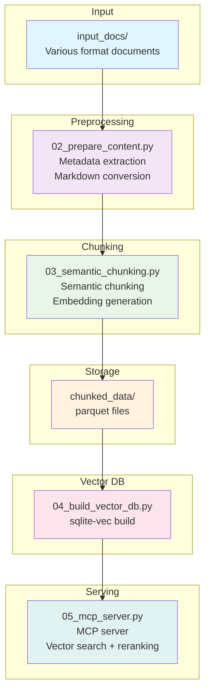

# AI Pack - Semantic Chunking with BGE-M3

[](https://opensource.org/licenses/Apache-2.0)
[](https://www.python.org/)
[](https://modelcontextprotocol.io/)

A semantic chunking tool using the BGE-M3 embedding model.  
Converts documents of various formats to Markdown, splits them based on semantic meaning, and preserves heading hierarchy.

## Project Concept

> Basecamp for various RAG extensions + Simple preview

aipack provides a foundation for vector RAG while serving as a starting point for extensions like graph RAG and hybrid RAG:

- **Basecamp Role**: Parquet files act as "extension hubs" for easy migration to various backends like Milvus, Qdrant, Memgraph
- **Preview Role**: MCP server enables testing/prototyping before building full RAG applications
- **Database Neutrality**: Not tied to specific vector DBs, flexible expansion based on parquet
- **Incremental Updates**: Flexible response to changes in embedding models or source content

## Architecture



Intermediate results from each step are saved as parquet files, making various experiments and external system migrations easy.

## Features

- **Support for Various Document Formats**: Using Microsoft markitdown
  - Office documents: Word (.docx), Excel (.xlsx), PowerPoint (.pptx)
  - PDF, HTML, XML, JSON, CSV
  - Images (EXIF/OCR), Audio (speech recognition), Video (subtitle extraction)
  - Code files, Jupyter Notebook, ZIP archives
- **Microsoft Foundry Service Integration** (Optional)
  - Document Intelligence: Enhanced OCR for scanned PDFs and images
  - Azure OpenAI (GPT-4o): Image content understanding
  - Only configured services are automatically activated
- **Semantic Chunking**: Chunk splitting based on semantic similarity
- **Markdown Structure Preservation**: Maintains hierarchical information like heading levels and section paths
- **Multilingual Support**: BGE-M3's support for 100+ languages
- **Incremental Updates**: Change detection based on content hash
- **zstd Compression**: Efficient parquet storage
- **BGE Reranker**: Reranking support for improved search result accuracy
- **CPU-Friendly**: Works without GPU (automatically uses GPU if available)

## Supported File Formats

| Category | Extensions |
| -------- | ---------- |
| Office Documents | `.docx`, `.doc`, `.xlsx`, `.xls`, `.pptx`, `.ppt` |
| PDF/Web | `.pdf`, `.html`, `.htm`, `.xml`, `.json`, `.csv` |
| Markdown/Text | `.md`, `.markdown`, `.txt`, `.rst` |
| Images (EXIF/OCR) | `.jpg`, `.jpeg`, `.png`, `.gif`, `.bmp`, `.webp`, `.tiff` |
| Audio (Speech Recognition) | `.mp3`, `.wav`, `.m4a`, `.ogg`, `.flac` |
| Video (Subtitle Extraction) | `.mp4`, `.mkv`, `.avi`, `.mov`, `.webm` |
| Code/Other | `.py`, `.js`, `.ts`, `.java`, `.c`, `.cpp`, `.ipynb`, `.zip` |

## Module Structure

| Module | Description |
| ------ | ----------- |
| `01_download_model.py` | BGE-M3 embedding model and reranker model download |
| `02_prepare_content.py` | Metadata extraction and YAML front matter generation |
| `03_semantic_chunking.py` | Semantic chunking and parquet storage |
| `04_build_vector_db.py` | sqlite-vec vector DB build and search |
| `05_mcp_server.py` | MCP server (stdio/SSE mode support) |

## Installation

### Installing uv

uv is a fast Python package manager. Install it from the official repository:

**Windows (PowerShell):**

```powershell
powershell -c "irm https://astral.sh/uv/install.ps1 | iex"
```

**Linux/macOS:**

```bash
curl -LsSf https://astral.sh/uv/install.sh | sh
```

Or install via pip:

```bash
pip install uv
```

For more installation options, visit: <https://github.com/astral-sh/uv>.

### Installing Dependencies

```bash
# Using uv (recommended)
uv sync

# Or using pip
pip install FlagEmbedding mistune pyarrow pandas pyyaml markitdown[all]
```

> **Note**: The `huggingface-hub[hf_xet]` package is included to improve download speeds for Xet Storage-supported models.

## Containerization

The program can be containerized using Docker. Model files are mounted as host volumes for caching.

### Build and Run

```bash
# Build image
docker-compose build

# Run (automatic model download → data processing → server start)
docker-compose up

# Or stdio mode
docker-compose run --rm aipack ./entrypoint.sh

# Specify port
PORT=9090 docker-compose up
```

### Execution Flow

The container automatically performs the following steps on startup:

1. **Model Download**: Check cache and download BGE-M3 and reranker models
2. **Data Processing**: If `input_docs/` exists, prepare documents → chunking → vector DB build
3. **Server Start**: Run MCP server (SSE mode by default)

> **Note**: Works even in environments without uv or Python runtime (multi-stage build)

### Volume Mounts

- **Model Cache**: `./cache/huggingface` → `/root/.cache/huggingface` in container
  - Stores large files like BGE-M3 and reranker models in project's `cache/` directory
  - Explicit `cache_dir` setting in code controls cache location
  - Cache reuse on container restart saves download time
- **Data Directories**: `input_docs`, `prepared_contents`, `chunked_data`, `vector_db`
  - Data sharing between host and container

### Environment Variables

- `PYTHONUNBUFFERED=1`: Immediate log output

## Microsoft Foundry Service Integration (Optional)

Works with basic markitdown alone, but better results can be achieved by integrating Microsoft Foundry services.

### Supported Services

| Service | Purpose | Enhanced Features |
| ------- | ------- | ----------------- |
| Document Intelligence | Scanned PDF, image OCR | Text extraction accuracy |
| Azure OpenAI (GPT-4o) | Image content understanding | Image description generation |

### Configuration

```bash
# 1. Create environment file
cp .env.example .env

# 2. Enter only necessary keys (only configured services are activated)
```

Example `.env` file:

```env
# Document Intelligence (scanned PDF, image OCR)
AZURE_DOCUMENT_INTELLIGENCE_ENDPOINT=https://your-resource.cognitiveservices.azure.com/
AZURE_DOCUMENT_INTELLIGENCE_KEY=your-key

# Azure OpenAI (image content understanding)
AZURE_OPENAI_ENDPOINT=https://your-openai.openai.azure.com/
AZURE_OPENAI_API_KEY=your-key
AZURE_OPENAI_DEPLOYMENT_NAME=gpt-4o
```

### Operation

- **No Keys**: Uses basic markitdown only
- **Some Services Configured**: Only those services are activated
- **All Configured**: Full functionality activated

Integration status is displayed during execution:

```text
🔗 Azure services integrated: Document Intelligence, OpenAI (gpt-4o)
```

Or:

```text
ℹ️ Azure services not integrated (using basic markitdown)
```

## Usage

### 1. Model Download (One-time)

```bash
python 01_download_model.py
```

### 2. Document Preparation

Place files in `input_docs/` directory (various formats supported):

```bash
python 02_prepare_content.py
```

All supported file formats are converted to Markdown with metadata added.

### 3. Semantic Chunking

```bash
python 03_semantic_chunking.py
```

Options:

- `--input-dir`: Input directory (default: `prepared_contents`)
- `--output-dir`: Output directory (default: `chunked_data`)
- `--similarity-threshold`: Similarity threshold (default: 0.5)

### 4. Vector DB Build

```bash
python 04_build_vector_db.py
```

Options:

- `--input-dir`: Input directory (default: `chunked_data`)
- `--output-dir`: Output directory (default: `vector_db`)
- `--db-name`: DB filename (default: `vectors.db`)
- `--export-parquet`: Export parquet for Milvus/Qdrant migration
- `--test-search "query"`: Perform test search after build

#### Vector DB Portability

Exported parquet files (`vectors_export.parquet`) can be directly imported to the following vector DBs:

| Vector DB | Import Method |
| --------- | ------------- |
| **Milvus** | Direct import using `pymilvus`'s `insert()` method |
| **Qdrant** | Upsert via REST API or Python client |
| **Pinecone** | Direct import using `upsert()` method |
| **Chroma** | Direct import using `add()` method |

Vector format: `float32[1024]` (BGE-M3 Dense vectors)

### 5. MCP Server Execution

Provides vector search via MCP protocol.

#### stdio Mode (Claude Desktop, Cursor, etc.)

```bash
python 05_mcp_server.py
```

#### SSE Mode (Web clients)

```bash
python 05_mcp_server.py --sse --port 8080
```

Options:

- `--db-path`: Vector DB path (default: `vector_db/vectors.db`)
- `--sse`: Run in SSE mode
- `--host`: SSE server host (default: `127.0.0.1`)
- `--port`: SSE server port (default: `8080`)

#### Available Tools

| Tool | Description |
| ---- | ----------- |
| `search` | Vector similarity search + reranking |
| `get_chunk` | Detailed lookup by chunk ID |
| `list_documents` | Document list lookup |
| `get_stats` | DB statistics lookup |

#### Claude Desktop Configuration Example

`claude_desktop_config.json`:

```json
{
  "mcpServers": {
    "aipack-vector-search": {
      "command": "python",
      "args": ["D:/Projects/aipack/05_mcp_server.py"]
    }
  }
}
```

## Output Schema

| Field | Type | Description |
| ----- | ---- | ----------- |
| `chunk_id` | string | Unique chunk ID |
| `content_hash` | string | Content hash (for incremental updates) |
| `chunk_text` | string | Chunk text |
| `chunk_type` | string | Type (header, paragraph, list, code, table) |
| `heading_level` | int32 | Heading level (0=normal, 1-6=H1-H6) |
| `heading_text` | string | Current heading text |
| `parent_heading` | string | Parent heading text |
| `section_path` | list[string] | Section hierarchy path array |
| `table_headers` | list[string] | Table column headers (if table) |
| `table_row_count` | int32 | Table data row count (if table) |
| `domain` | string | Domain (metadata) |
| `keywords` | string | Keywords JSON (metadata) |
| `version` | int32 | Version number |

## Directory Structure

```text
aipack/
├── 01_download_model.py       # BGE-M3 model download
├── 02_prepare_content.py      # Metadata extraction + Azure integration
├── 03_semantic_chunking.py    # Semantic chunking
├── 04_build_vector_db.py      # Vector DB build
├── 05_mcp_server.py           # MCP server (stdio/SSE)
├── input_docs/                # Input documents
├── prepared_contents/         # Documents with metadata added
├── chunked_data/              # Chunked parquet files
├── vector_db/                 # sqlite-vec vector DB
│   ├── vectors.db             # Local vector DB
│   └── vectors_export.parquet # Export file for migration
├── .env.example               # Environment variable template
├── pyproject.toml
└── README.md
```

## Examples

### Input Markdown

```markdown
# Title

## Section 1
Content...

## Section 2
Other content...
```

### Output Parquet Example

| chunk_id | heading_level | heading_text | section_path |
| -------- | ------------- | ------------ | ------------ |
| abc123 | 1 | Title | # Title |
| def456 | 2 | Section 1 | # Title / ## Section 1 |
| ghi789 | 2 | Section 2 | # Title / ## Section 2 |

## System Requirements

- Python 3.11+
- ~5GB disk space (for BGE-M3 + reranker models)
- 8GB+ RAM recommended
- GPU (optional): Automatically utilized if CUDA-compatible GPU available

## Future Extension Possibilities

The current system is designed with the following extensions in mind:

| Extension Direction | Description | Current Status |
| ------------------- | ----------- | -------------- |
| **Graph RAG** | Ontology-based entity/relation extraction → Node/edge parquet generation | Design completed |
| **Hybrid Search** | Combination of keyword + vector + graph search | Vector + reranking implemented |
| **Homonym Handling** | Context distinction via domain-specific ontology mapping | Metadata-based |
| **Multiple Vector DBs** | Migration to Milvus, Qdrant, Pinecone, etc. | Parquet export supported |

## Contributing

1. Fork this repository.
2. Create a new branch: `git checkout -b feature/amazing-feature`
3. Commit your changes: `git commit -m 'Add amazing feature'`
4. Push to the branch: `git push origin feature/amazing-feature`
5. Create a Pull Request.

## License

This project is licensed under the [Apache License 2.0](LICENSE).

## 모듈 구성

| 모듈 | 설명 |
| ------ | ------ |
| `01_download_model.py` | BGE-M3 임베딩 모델 및 리랭커 모델 다운로드 |
| `02_prepare_content.py` | 메타데이터 추출 및 YAML front matter 생성 |
| `03_semantic_chunking.py` | 시맨틱 청킹 및 parquet 저장 |
| `04_build_vector_db.py` | sqlite-vec 벡터 DB 빌드 및 검색 |
| `05_mcp_server.py` | MCP 서버 (stdio/SSE 모드 지원) |

## 설치

```bash
# uv 사용 (권장)
uv sync

# 또는 pip
pip install FlagEmbedding mistune pyarrow pandas pyyaml markitdown[all]
```

> **참고**: `huggingface-hub[hf_xet]` 패키지가 포함되어 있어, Xet Storage 지원 모델의 다운로드 속도가 향상됩니다.

## 컨테이너화

Docker를 사용하여 프로그램을 컨테이너화할 수 있습니다. 모델 파일은 호스트 볼륨으로 마운트하여 캐시합니다.

### 빌드 및 실행

```bash
# 이미지 빌드
docker-compose build

# 실행 (자동으로 모델 다운로드 → 데이터 처리 → 서버 시작)
docker-compose up

# 또는 stdio 모드
docker-compose run --rm aipack ./entrypoint.sh

# 포트 지정
PORT=9090 docker-compose up
```

### 실행 흐름

컨테이너 시작 시 자동으로 다음 단계를 수행합니다:

1. **모델 다운로드**: 캐시 확인 후 BGE-M3 및 리랭커 모델 다운로드
2. **데이터 처리**: `input_docs/` 존재 시 문서 준비 → 청킹 → 벡터 DB 빌드
3. **서버 시작**: MCP 서버 실행 (SSE 모드 기본)

> **참고**: uv나 Python 런타임이 없는 환경에서도 실행 가능 (멀티스테이지 빌드)

### 볼륨 마운트

- **모델 캐시**: `./cache/huggingface` → 컨테이너 내 `/root/.cache/huggingface`
  - BGE-M3, 리랭커 모델 등 대용량 파일을 프로젝트 내 `cache/` 디렉터리에 저장
  - 코드에서 명시적으로 `cache_dir` 설정하여 캐시 위치 제어
  - 컨테이너 재시작 시 캐시 재사용, 다운로드 시간 절약
- **데이터 디렉터리**: `input_docs`, `prepared_contents`, `chunked_data`, `vector_db`
  - 호스트와 컨테이너 간 데이터 공유

### 환경 변수

- `PYTHONUNBUFFERED=1`: 로그 출력 즉시 표시

## Microsoft Foundry 서비스 연동 (선택사항)

기본 markitdown만으로도 동작하지만, Microsoft Foundry 서비스를 연동하면 더 나은 결과를 얻을 수 있습니다.

### 지원 서비스

| 서비스 | 용도 | 향상되는 기능 |
| ------ | ------ | ------ |
| Document Intelligence | 스캔 PDF, 이미지 OCR | 텍스트 추출 정확도 |
| Azure OpenAI (GPT-4o) | 이미지 내용 이해 | 이미지 설명 생성 |

### 설정 방법

```bash
# 1. 환경 파일 생성
cp .env.example .env

# 2. 필요한 키만 입력 (설정된 서비스만 활성화됨)
```

`.env` 파일 예시:

```env
# Document Intelligence (스캔 PDF, 이미지 OCR)
AZURE_DOCUMENT_INTELLIGENCE_ENDPOINT=https://your-resource.cognitiveservices.azure.com/
AZURE_DOCUMENT_INTELLIGENCE_KEY=your-key

# Azure OpenAI (이미지 내용 이해)
AZURE_OPENAI_ENDPOINT=https://your-openai.openai.azure.com/
AZURE_OPENAI_API_KEY=your-key
AZURE_OPENAI_DEPLOYMENT_NAME=gpt-4o
```

### 동작 방식

- **키 없음**: 기본 markitdown만 사용
- **일부 서비스만 설정**: 해당 서비스만 활성화
- **모두 설정**: 전체 기능 활성화

실행 시 연동 상태가 표시됩니다:

```text
🔗 Azure 서비스 연동: Document Intelligence, OpenAI (gpt-4o)
```

또는:

```text
ℹ️ Azure 서비스 미연동 (기본 markitdown 사용)
```

## 사용법

### 1. 모델 다운로드 (최초 1회)

```bash
python 01_download_model.py
```

### 2. 문서 준비

`input_docs/` 디렉터리에 파일을 넣고 (다양한 형식 지원):

```bash
python 02_prepare_content.py
```

지원되는 모든 형식의 파일이 마크다운으로 변환되고 메타데이터가 추가됩니다.

### 3. 시맨틱 청킹

```bash
python 03_semantic_chunking.py
```

옵션:

- `--input-dir`: 입력 디렉터리 (기본: `prepared_contents`)
- `--output-dir`: 출력 디렉터리 (기본: `chunked_data`)
- `--similarity-threshold`: 유사도 임계값 (기본: 0.5)

### 4. 벡터 DB 빌드

```bash
python 04_build_vector_db.py
```

옵션:

- `--input-dir`: 입력 디렉터리 (기본: `chunked_data`)
- `--output-dir`: 출력 디렉터리 (기본: `vector_db`)
- `--db-name`: DB 파일명 (기본: `vectors.db`)
- `--export-parquet`: Milvus/Qdrant 이식용 Parquet 내보내기
- `--test-search "쿼리"`: 빌드 후 테스트 검색 수행

#### 벡터 DB 이식성

내보내기된 Parquet 파일(`vectors_export.parquet`)은 다음 벡터 DB로 직접 이식 가능:

| 벡터 DB | 이식 방법 |
| ------ | ------ |
| **Milvus** | `pymilvus`의 `insert()` 메서드로 직접 import |
| **Qdrant** | REST API 또는 Python 클라이언트로 upsert |
| **Pinecone** | `upsert()` 메서드로 직접 import |
| **Chroma** | `add()` 메서드로 직접 import |

벡터 형식: `float32[1024]` (BGE-M3 Dense 벡터)

### 5. MCP 서버 실행

벡터 검색을 MCP 프로토콜로 제공합니다.

#### stdio 모드 (Claude Desktop, Cursor 등)

```bash
python 05_mcp_server.py
```

#### SSE 모드 (웹 클라이언트)

```bash
python 05_mcp_server.py --sse --port 8080
```

옵션:

- `--db-path`: 벡터 DB 경로 (기본: `vector_db/vectors.db`)
- `--sse`: SSE 모드로 실행
- `--host`: SSE 서버 호스트 (기본: `127.0.0.1`)
- `--port`: SSE 서버 포트 (기본: `8080`)

#### 제공 도구 (Tools)

| 도구 | 설명 |
| ------ | ------ |
| `search` | 벡터 유사도 검색 + 리랭킹 |
| `get_chunk` | 청크 ID로 상세 조회 |
| `list_documents` | 문서 목록 조회 |
| `get_stats` | DB 통계 조회 |

#### Claude Desktop 설정 예시

`claude_desktop_config.json`:

```json
{
  "mcpServers": {
    "aipack-vector-search": {
      "command": "python",
      "args": ["D:/Projects/aipack/05_mcp_server.py"]
    }
  }
}
```

## 출력 스키마

| 필드 | 타입 | 설명 |
| ------ | ------ | ------ |
| `chunk_id` | string | 청크 고유 ID |
| `content_hash` | string | 콘텐츠 해시 (증분 업데이트용) |
| `chunk_text` | string | 청크 텍스트 |
| `chunk_type` | string | 타입 (header, paragraph, list, code, table) |
| `heading_level` | int32 | 헤딩 레벨 (0=일반, 1-6=H1-H6) |
| `heading_text` | string | 현재 헤딩 텍스트 |
| `parent_heading` | string | 부모 헤딩 텍스트 |
| `section_path` | list[string] | 섹션 계층 경로 배열 |
| `table_headers` | list[string] | 표 컬럼 헤더 (표인 경우) |
| `table_row_count` | int32 | 표 데이터 행 수 (표인 경우) |
| `domain` | string | 도메인 (메타데이터) |
| `keywords` | string | 키워드 JSON (메타데이터) |
| `version` | int32 | 버전 번호 |

## 디렉터리 구조

```text
aipack/
├── 01_download_model.py       # BGE-M3 모델 다운로드
├── 02_prepare_content.py      # 메타데이터 추출 + Azure 연동
├── 03_semantic_chunking.py    # 시맨틱 청킹
├── 04_build_vector_db.py      # 벡터 DB 빌드
├── 05_mcp_server.py           # MCP 서버 (stdio/SSE)
├── input_docs/                # 입력 문서
├── prepared_contents/         # 메타데이터 추가된 문서
├── chunked_data/              # 청킹된 parquet 파일
├── vector_db/                 # sqlite-vec 벡터 DB
│   ├── vectors.db             # 로컬 벡터 DB
│   └── vectors_export.parquet # 이식용 내보내기 파일
├── .env.example               # 환경 변수 템플릿
├── pyproject.toml
└── README.md
```

## 예시

### 입력 마크다운

```markdown
# 제목

## 섹션 1
내용...

## 섹션 2
다른 내용...
```

### 출력 parquet 예시

| chunk_id | heading_level | heading_text | section_path |
| ---------- | --------------- | -------------- | -------------- |
| abc123 | 1 | 제목 | # 제목 |
| def456 | 2 | 섹션 1 | # 제목 / ## 섹션 1 |
| ghi789 | 2 | 섹션 2 | # 제목 / ## 섹션 2 |

## 시스템 요구사항

- Python 3.11 이상
- 약 5GB 디스크 공간 (BGE-M3 + 리랭커 모델용)
- 8GB 이상 RAM 권장
- GPU (선택사항): CUDA 지원 GPU가 있으면 자동으로 활용

## 향후 확장 가능성

현재 시스템은 다음과 같은 확장을 염두에 두고 설계되었습니다:

| 확장 방향 | 설명 | 현재 상태 |
| -------- | ---- | -------- |
| **그래프 RAG** | 온톨로지 기반 엔티티/관계 추출 → 노드/엣지 parquet 생성 | 설계 완료 |
| **하이브리드 검색** | 키워드 + 벡터 + 그래프 검색 결합 | 벡터+리랭킹 구현 |
| **동음이의어 대비** | 도메인별 온톨로지 매핑으로 맥락 구분 | 메타데이터 기반 |
| **다중 벡터 DB** | Milvus, Qdrant, Pinecone 등으로 이식 | parquet export 지원 |

## 기여 방법

1. 이 저장소를 포크합니다.
2. 새 브랜치를 생성합니다: `git checkout -b feature/amazing-feature`
3. 변경 사항을 커밋합니다: `git commit -m 'Add amazing feature'`
4. 브랜치에 푸시합니다: `git push origin feature/amazing-feature`
5. Pull Request를 생성합니다.

## 라이선스

이 프로젝트는 [Apache License 2.0](LICENSE.md) 하에 라이선스됩니다.
