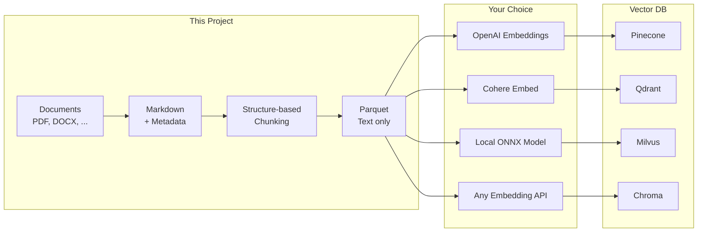

# Reconsidered RAG

[](https://opensource.org/licenses/Apache-2.0)
[](https://www.python.org/)
[](https://github.com/sponsors/rkttu)

English | **[한국어](README.ko.md)**

[](https://youtu.be/Uj6Vz5CZ4c4)

**RAG-ready document preparation: offline, portable, infrastructure-agnostic.**

---

## What this project does



**This project:**

- ✅ Converts documents to Markdown
- ✅ Chunks by structure (headings, paragraphs)
- ✅ Exports as Parquet (text only)

**Your responsibility:**

- Embedding model selection
- Vector DB choice
- Production serving

---

## Why this approach?

| Problem | Our Solution |
| ------- | ------------ |
| Embedding models change fast | Text in Parquet, re-embed anytime |
| Can't decide on vector DB | Prepare once, import anywhere |
| Data can't leave local machine | Everything runs offline |
| Need to audit/review content | Human-readable Markdown checkpoint |

---

## Pipeline

| Step | Script | Input | Output |
| ---- | ------ | ----- | ------ |
| 1 | `01_prepare_content.py` | Documents (input_docs/) | Markdown (prepared_contents/) |
| 2 | `02_chunk_content.py` | Markdown | Chunk Parquet (chunked_data/) |

**That's it. 2 steps.**

No embedding model. No vector DB. Just document preparation.

### Optional: LLM Enrichment

Use Microsoft Foundry GPT-4.1 to enhance metadata:

```bash
# Set environment variables
export ENRICHMENT_ENDPOINT="https://your-endpoint.inference.ai.azure.com"
export ENRICHMENT_API_KEY="your-api-key"
export ENRICHMENT_MODEL="gpt-4.1"

# Run with enrichment
uv run python 01_prepare_content.py --enrich
```

This adds:

- `llm_summary`: AI-generated summary
- `llm_keywords`: Semantic keywords beyond headings
- `llm_questions`: Questions this document can answer
- `llm_entities`: Named entities and concepts
- `llm_difficulty`: Estimated difficulty level

---

## Two Human-Readable Checkpoints

### 1. `prepared_contents/` — Editable Markdown

- **Auto-enriched**: OCR, image descriptions, speech-to-text (optional, via Azure AI)
- **Human-editable**: Fix errors, add context, remove noise
- **Version-controllable**: Plain text works with Git

### 2. `chunked_data/` — Portable Parquet

- **Chunk text preserved**: Original text for embedding with any model
- **Structure info**: `section_path`, `heading_level`, `element_type`
- **Table metadata**: `table_headers`, `table_row_count`

---

## Quick Start

```bash
# Install dependencies (minimal)
uv sync

# 1. Prepare documents (put files in input_docs/)
uv run python 01_prepare_content.py

# 2. Structure-based chunking
uv run python 02_chunk_content.py

# Done! Check chunked_data/*.parquet
```

### Using the Parquet files

```python
import pandas as pd

# Load chunks
df = pd.read_parquet("chunked_data/your_document.parquet")

# Get text for embedding
texts = df["chunk_text"].tolist()

# Use any embedding model
from openai import OpenAI
client = OpenAI()
embeddings = client.embeddings.create(
    model="text-embedding-3-large",
    input=texts
).data

# Insert to any vector DB
# ... your code here
```

---

## Supported File Formats

| Category | Extensions |
| -------- | ---------- |
| Office | `.docx`, `.xlsx`, `.pptx`, etc. |
| PDF/Web | `.pdf`, `.html`, `.xml`, `.json`, `.csv` |
| Markdown/Text | `.md`, `.txt`, `.rst` |
| Images (EXIF/OCR) | `.jpg`, `.png`, `.webp`, etc. |
| Audio (Speech-to-text) | `.mp3`, `.wav`, `.m4a`, etc. |
| Video (Subtitle extraction) | `.mp4`, `.mkv`, `.avi`, etc. |
| Code | `.py`, `.js`, `.ts`, `.java`, etc. |

---

## Chunking Strategy

**Structure-based chunking** respects document structure:

1. **Heading boundaries**: Each heading starts a new chunk
2. **Tables/Code/Lists**: Kept intact when possible
3. **Large paragraphs**: Split at sentence boundaries with overlap
4. **Configurable sizes**: `--max-chunk-size`, `--min-chunk-size`

```bash
# Custom chunk sizes
uv run python 02_chunk_content.py --max-chunk-size 1500 --min-chunk-size 50
```

---

## Optional: Vector DB & MCP Server

Build a local vector database with BGE-M3 and test via MCP:

```bash
# Install optional dependencies
uv sync --extra vectordb
uv sync --extra mcp

# Build vector DB (uses BGE-M3 by default)
uv run python 03_build_vector_db.py

# Other embedding models available
uv run python 03_build_vector_db.py --model intfloat/multilingual-e5-large
uv run python 03_build_vector_db.py --model sentence-transformers/all-MiniLM-L6-v2

# List supported models
uv run python 03_build_vector_db.py --list-models

# Test search
uv run python 03_build_vector_db.py --test-search "how to deploy kubernetes"

# Run MCP server for RAG testing
uv run python 04_mcp_server.py

# SSE mode for HTTP clients
uv run python 04_mcp_server.py --sse --port 8080
```

Supported embedding models:

| Model | Dimension | Notes |
| ----- | --------- | ----- |
| `BAAI/bge-m3` | 1024 | Default, multilingual |
| `intfloat/multilingual-e5-large` | 1024 | Good for non-English |
| `sentence-transformers/all-MiniLM-L6-v2` | 384 | Fast, English-focused |

---

## Detailed Documentation

For installation, configuration, Docker, IDE integration, and more, see **[IMPLEMENTATION.md](IMPLEMENTATION.md)**.

---

## License

[Apache License 2.0](LICENSE)

## Sponsorship

If you find this project helpful, please consider sponsoring on GitHub Sponsors.

[](https://github.com/sponsors/rkttu)

## Contributing

1. Fork this repository
2. Create a branch: `git checkout -b feature/amazing-feature`
3. Commit: `git commit -m 'Add amazing feature'`
4. Push: `git push origin feature/amazing-feature`
5. Create a Pull Request
