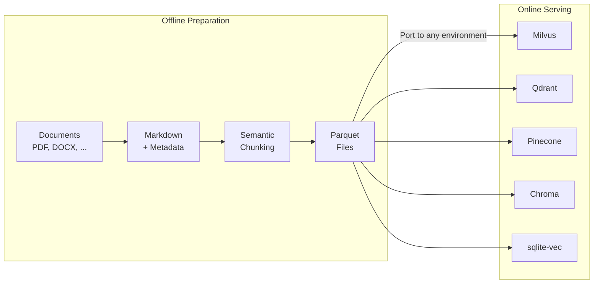

# Reconsidered RAG

[](https://opensource.org/licenses/Apache-2.0)
[](https://www.python.org/)
[](https://modelcontextprotocol.io/)
[](https://github.com/sponsors/rkttu)

English | **[한국어](README.ko.md)**

[](https://youtu.be/Uj6Vz5CZ4c4)

**Rethinking how RAG datasets should be prepared: offline, portable, and infrastructure-agnostic.**

---

## What this project does



**Core values:**

- 🖥️ **No GPU required** — CPU-only embedding with ONNX optimization
- 📦 **Parquet-based** — Universal format, portable anywhere
- 🔒 **Offline preparation** — Data never leaves your machine
- 🔄 **Re-embedding friendly** — Switch to better models anytime

---

## Why this approach?

| Situation | This project's approach |
| ----------- | ------------------------ |
| Haven't decided on a vector DB yet | Prepare as parquet, decide later |
| No GPU server available | Process with ONNX on CPU |
| Can't send data to cloud | Everything runs locally |
| Better embedding model comes out later | Text is in parquet, just re-compute |
| Want to prototype quickly | Test immediately with sqlite-vec |

---

## Pipeline

| Step | Script | Input | Output |
| ------ | -------- | ------- | -------- |
| 1 | `01_download_model.py` | - | ONNX model (cache/) |
| 2 | `02_prepare_content.py` | Documents (input_docs/) | Markdown (prepared_contents/) |
| 3 | `03_semantic_chunking.py` | Markdown | Chunk parquet (chunked_data/) |
| 4 | `04_build_vector_db.py` | Chunk parquet | Vector DB (vector_db/) |
| 5 | `05_build_mcp_server.py` | Vector DB | MCP server (for testing) |

**All intermediate results are saved as parquet.** You can export from any step and migrate to another system.

---

## Two Human-Readable Checkpoints

### 1. `prepared_contents/` — Editable Markdown

- **Auto-enriched**: OCR, image descriptions, speech-to-text via Azure AI
- **Human-editable**: Fix OCR errors, add context, remove noise
- **Version-controllable**: Plain text format works with Git

### 2. `chunked_data/` — Portable Parquet

- **Chunk text preserved**: Original text for re-embedding anytime
- **Structure info**: `section_path`, `heading_level`, `element_type`
- **Table metadata**: `table_headers`, `table_row_count`

---

## Vector DB Portability

Files exported with `04_build_vector_db.py --export-parquet` can be directly imported to:

| Vector DB | Import Method |
| ----------- | --------------- |
| **Milvus** | `pymilvus` `insert()` |
| **Qdrant** | REST API or Python client `upsert()` |
| **Pinecone** | `upsert()` |
| **Chroma** | `add()` |

Vector format: `float32[1024]` (PIXIE-Rune Dense vectors)

**Want to re-compute embeddings?**  
Original text (`chunk_text`) is in parquet — use OpenAI `text-embedding-3-large`, Cohere, or any model you prefer.

---

## Quick Start

```bash
# Install dependencies
uv sync

# 1. Download model + ONNX conversion (one-time)
uv run python 01_download_model.py

# 2. Prepare documents (put files in input_docs/)
uv run python 02_prepare_content.py

# 3. Semantic chunking
uv run python 03_semantic_chunking.py

# 4. Build vector DB (+ export parquet)
uv run python 04_build_vector_db.py --export-parquet

# 5. (Optional) Test with MCP server
uv run python 05_build_mcp_server.py
```

---

## Supported File Formats

| Category | Extensions |
| ---------- | ------------ |
| Office | `.docx`, `.xlsx`, `.pptx`, etc. |
| PDF/Web | `.pdf`, `.html`, `.xml`, `.json`, `.csv` |
| Markdown/Text | `.md`, `.txt`, `.rst` |
| Images (EXIF/OCR) | `.jpg`, `.png`, `.webp`, etc. |
| Audio (Speech-to-text) | `.mp3`, `.wav`, `.m4a`, etc. |
| Video (Subtitle extraction) | `.mp4`, `.mkv`, `.avi`, etc. |
| Code | `.py`, `.js`, `.ts`, `.java`, etc. |

---

## About Speed

**This project is not fast.** And that's okay.

- This is an **offline preparation tool**
- You build it once
- Production serving happens in faster environments (GPU, cloud vector DBs)

If speed is your top priority, use OpenAI Embeddings API + Pinecone.  
**If your goal is to prepare data without sending it outside**, this project is for you.

---

## Detailed Documentation

For installation, configuration, Docker, IDE integration, and more, see **[IMPLEMENTATION.md](IMPLEMENTATION.md)**.

---

## License

[Apache License 2.0](LICENSE)

## Sponsorship

If you find this project helpful, please consider sponsoring on GitHub Sponsors.

[](https://github.com/sponsors/rkttu)

## Contributing

1. Fork this repository
2. Create a branch: `git checkout -b feature/amazing-feature`
3. Commit: `git commit -m 'Add amazing feature'`
4. Push: `git push origin feature/amazing-feature`
5. Create a Pull Request
